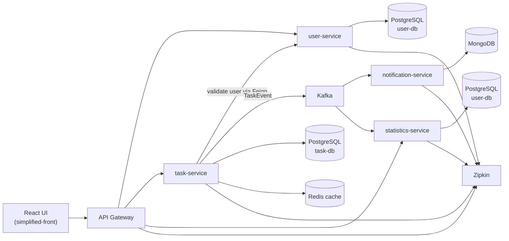

# Task Management Platform

Microservice-based task management platform with JWT auth, task lifecycle, event-driven statistics, notifications, and a lightweight React UI for manual testing.

## Highlights

- Microservice architecture with a single API entry point (`api-gateway`)
- JWT authentication and role-based access (`ROLE_USER`, `ROLE_ADMIN`)
- Task lifecycle: create, update, start, complete, delete
- Event-driven integration via Kafka
- Aggregated statistics service (global and per-user)
- Notification service with MongoDB log storage
- Observability stack: Prometheus, Grafana, Zipkin, Loki

## Architecture



## Services

| Service | Responsibility | Storage / Integration |
|---|---|---|
| `api-gateway` | Single entry point, request routing, CORS | Spring Cloud Gateway |
| `user-service` | Registration, JWT auth, user management | PostgreSQL (`user-db`) |
| `task-service` | Task CRUD + lifecycle + business rules | PostgreSQL (`task-db`), Redis, Kafka |
| `statistics-service` | Global and per-user task analytics | PostgreSQL (`user-db`), Kafka |
| `notification-service` | Sends notifications and stores notification logs | Kafka, MongoDB, SMTP |
| `common` | Shared DTO/models/events | Maven module |
| `simplified-front` | Minimal React UI for API checks | Uses gateway API |

## Tech Stack

### Backend

- Java 21
- Spring Boot 3
- Spring Cloud Gateway
- Spring Data JPA
- Spring Validation
- Spring Security + JWT
- OpenFeign

### Data & Messaging

- PostgreSQL 15
- MongoDB
- Redis
- Apache Kafka (KRaft)
- Liquibase

### Observability

- Micrometer
- Prometheus
- Grafana
- Zipkin
- Loki

### Infra & Dev

- Docker / Docker Compose
- Maven (multi-module)

### Frontend (test UI)

- React
- React Router
- Tailwind

## Project Structure

```text
task-management/
|- api-gateway/
|- common/
|- db-init/
|- k8s/
|- notification-service/
|- simplified-front/
|- statistics-service/
|- task-service/
|- user-service/
|- docker-compose.yaml
|- pom.xml
`- README.md
```

## Prerequisites

- Docker + Docker Compose
- Optional for local run (without Docker): Java 21, Maven
- Optional for frontend: Node.js 20+

## Configuration

Create root `.env`:

```env
DB_USERNAME=postgres
DB_PASSWORD=postgres
DB_uNAME=user-db
DB_tNAME=task-db
GMAIL_USER=your_email@gmail.com
GMAIL_PASSWORD=your_app_password
```

Frontend env (`simplified-front/.env`):

```env
PORT=3001
REACT_APP_API_BASE_URL=http://localhost:8080
```

## Run with Docker Compose

```bash
docker compose up --build -d
```

Check containers:

```bash
docker compose ps
```

Stop:

```bash
docker compose down
```

## Run Frontend

```bash
cd simplified-front
npm install
npm start
```

## Main URLs

- Gateway: `http://localhost:8080`
- Frontend: `http://localhost:3001`
- Grafana: `http://localhost:3000`
- Prometheus: `http://localhost:9090`
- Zipkin: `http://localhost:9411`
- Mongo Express: `http://localhost:8085`

## API Overview (via Gateway)

Base URL: `http://localhost:8080`

### Auth / Users

- `POST /auth/sign-in`
- `POST /auth/refresh`
- `POST /users/registration`
- `GET /users/{id}`
- `PUT /users/{id}`
- `GET /users/email/{email}`

Admin routes:

- `GET /users`
- `POST /users/{id}/banUser`
- `DELETE /users/{id}/delete`

### Tasks

- `GET /tasks`
- `GET /tasks/{id}`
- `POST /tasks`
- `PUT /tasks/{id}`
- `DELETE /tasks/{id}`
- `POST /tasks/{id}/start`
- `POST /tasks/{id}/complete`

### Statistics

- `GET /stats/task`
- `GET /stats/user/{userId}`

## Event Flow

`task-service` publishes `TaskEvent` to Kafka topic `task-events`.

Consumers:

- `statistics-service` updates global and per-user counters
- `notification-service` sends notifications and stores event logs in MongoDB

## What to Improve Next (Portfolio Hardening)

- Add focused integration tests for auth/task/stats flow
- Restrict internal user endpoints for service-to-service calls only
- Remove secrets from tracked files and rotate credentials
- Add request/response examples in README (curl or Postman collection)
- Add k8s deployment notes (you already have `k8s/` manifests)

---

If you use this as a portfolio project, show one "hardening" pull request with security fixes and tests. This makes the project look much more mature than a simple feature-only demo.
