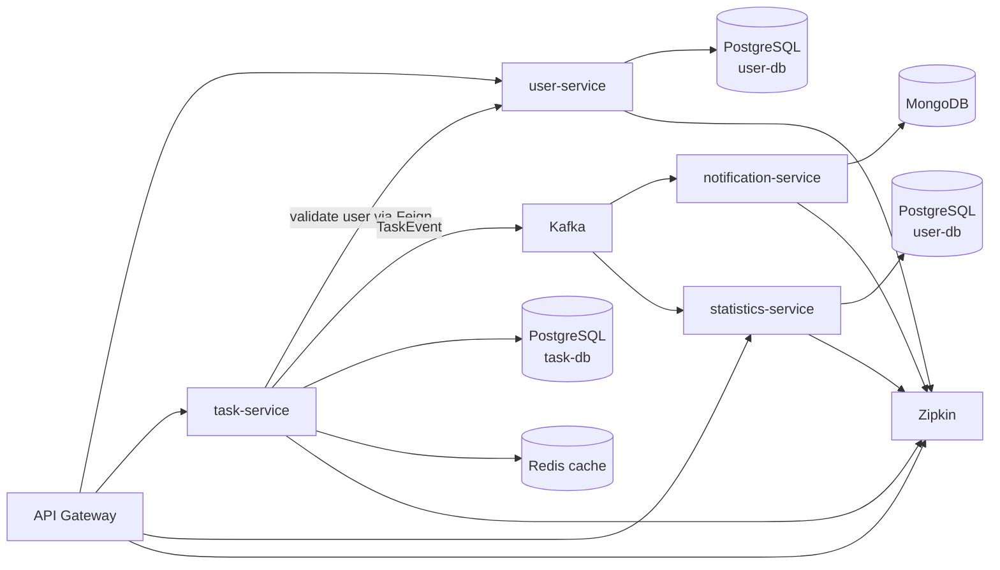

# Task Management Platform

Microservice-based task management platform with task lifecycle, event-driven statistics, notifications, and Keycloak-ready authentication.

## Highlights

- Microservice architecture with a single API entry point (`api-gateway`)
- Authentication is being moved to Keycloak
- Role-based access from Keycloak (`ROLE_USER`, `ROLE_ADMIN`)
- Task lifecycle: create, update, start, complete, delete
- Event-driven integration via Kafka
- Aggregated statistics service (global and per-user)
- Notification service with MongoDB log storage
- Observability stack: Prometheus, Grafana, Zipkin, Loki

## Architecture


```mermaid
flowchart LR
    GW["API Gateway"]

    GW --> US["user-service"]
    GW --> TS["task-service"]
    GW --> SS["statistics-service"]

    TS -->|"validate user via Feign"| US

    TS -->|"TaskEvent"| K["Kafka"]
    K --> NS["notification-service"]
    K --> SS

    US --> UDB[("PostgreSQL\nuser-db")]
    TS --> TDB[("PostgreSQL\ntask-db")]
    SS --> SDB[("PostgreSQL\nuser-db")]
    NS --> MDB[("MongoDB")]

    TS --> R[("Redis cache")]

    TS --> Z["Zipkin"]
    US --> Z
    SS --> Z
    NS --> Z
    GW --> Z
```

## Services

| Service | Responsibility | Storage / Integration |
|---|---|---|
| `api-gateway` | Single entry point, request routing, CORS | Spring Cloud Gateway |
| `user-service` | Profile management, user status, admin operations | PostgreSQL (`user-db`) |
| `task-service` | Task CRUD + lifecycle + business rules | PostgreSQL (`task-db`), Redis, Kafka |
| `statistics-service` | Global and per-user task analytics | PostgreSQL (`user-db`), Kafka |
| `notification-service` | Sends notifications and stores notification logs | Kafka, MongoDB, SMTP |
| `common` | Shared DTO/models/events | Maven module |

## Tech Stack

### Backend

- Java 21
- Spring Boot 3
- Spring Cloud Gateway
- Spring Data JPA
- Spring Validation
- Spring Security
- OpenFeign

### Data & Messaging

- PostgreSQL 15
- MongoDB
- Redis
- Apache Kafka (KRaft)
- Liquibase

### Observability

- Micrometer
- Prometheus
- Grafana
- Zipkin
- Loki

### Infra & Dev

- Docker / Docker Compose
- Maven (multi-module)

## Project Structure

```text
task-management/
|- api-gateway/
|- common/
|- db-init/
|- k8s/
|- notification-service/
|- statistics-service/
|- task-service/
|- user-service/
|- docker-compose.yaml
|- pom.xml
`- README.md
```

## Prerequisites

- Docker + Docker Compose
- Optional for local run (without Docker): Java 21, Maven

## Configuration

Create root `.env`:

```env
DB_USERNAME=postgres
DB_PASSWORD=postgres
DB_uNAME=user-db
DB_tNAME=task-db
GMAIL_USER=your_email@gmail.com
GMAIL_PASSWORD=your_app_password
```

## Run with Docker Compose

```bash
docker compose up --build -d
```

Check containers:

```bash
docker compose ps
```

Stop:

```bash
docker compose down
```

## Main URLs

- Gateway: `http://localhost:8080`
- Grafana: `http://localhost:3000`
- Prometheus: `http://localhost:9090`
- Zipkin: `http://localhost:9411`
- Mongo Express: `http://localhost:8085`

## API Overview (via Gateway)

Base URL: `http://localhost:8080`

### Users

Keycloak will issue access tokens. The gateway and services should accept `Bearer` tokens from Keycloak.

- `GET /users/{id}`
- `PUT /users/{id}`

Admin routes:

- `GET /users`
- `POST /users`
- `POST /users/{id}/banUser`
- `DELETE /users/{id}/delete`

### Tasks

- `GET /tasks`
- `GET /tasks/{id}`
- `POST /tasks`
- `PUT /tasks/{id}`
- `DELETE /tasks/{id}`
- `POST /tasks/{id}/start`
- `POST /tasks/{id}/complete`

### Statistics

- `GET /stats/task`
- `GET /stats/user/{userId}`

## Event Flow

`task-service` publishes `TaskEvent` to Kafka topic `task-events`.

Consumers:

- `statistics-service` updates global and per-user counters
- `notification-service` sends notifications and stores event logs in MongoDB

